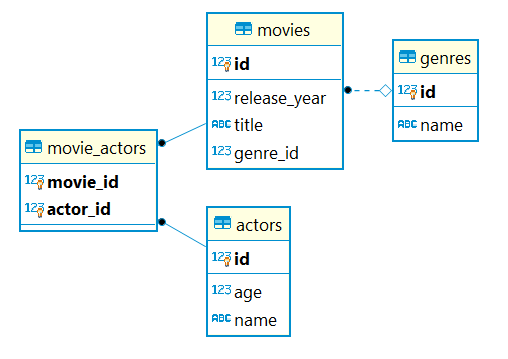

# Movie Recommendation System

Movie Recommendation REST API made using Spring Boot (with PostgresSQL Database)

:heavy_check_mark: Entities: **src/main/java/com/entities**

:heavy_check_mark: DTO: **src/main/java/com/dto**

Details: [https://en.wikipedia.org/wiki/Data_transfer_object](https://en.wikipedia.org/wiki/Data_transfer_object)

:heavy_check_mark: Repositories: **src/main/java/com/repositories**

:heavy_check_mark: Services (Business Logic): **src/main/java/com/services**

:heavy_check_mark: Controllers: **src/main/java/com/controllers**

:heavy_check_mark: Swagger configuration: **src/main/java/com/swagger**

:heavy_check_mark: Recommendation algorithm:

 - **src/main/java/com/graphs**
 - **src/main/java/com/services/MovieService/getMovieRecommendations**

:heavy_check_mark: Unit testing: **src/test/java/com/VertexCoverTests**
 
 

## :pushpin: ER Diagram

